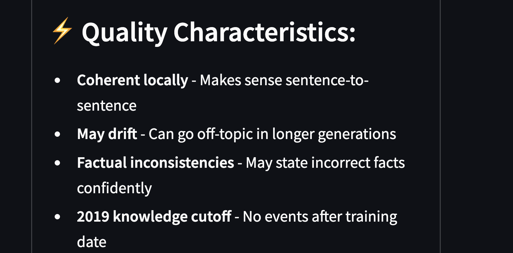
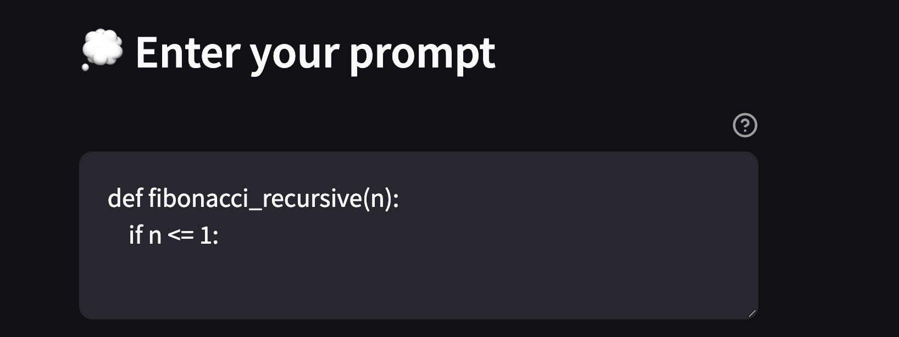
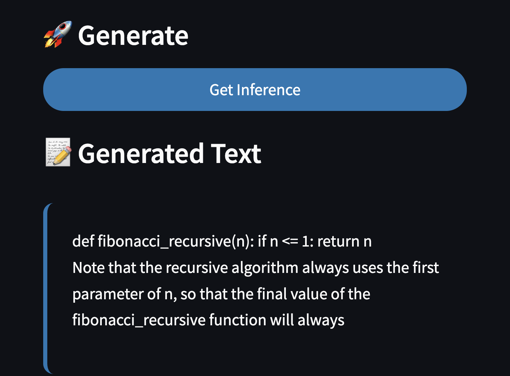
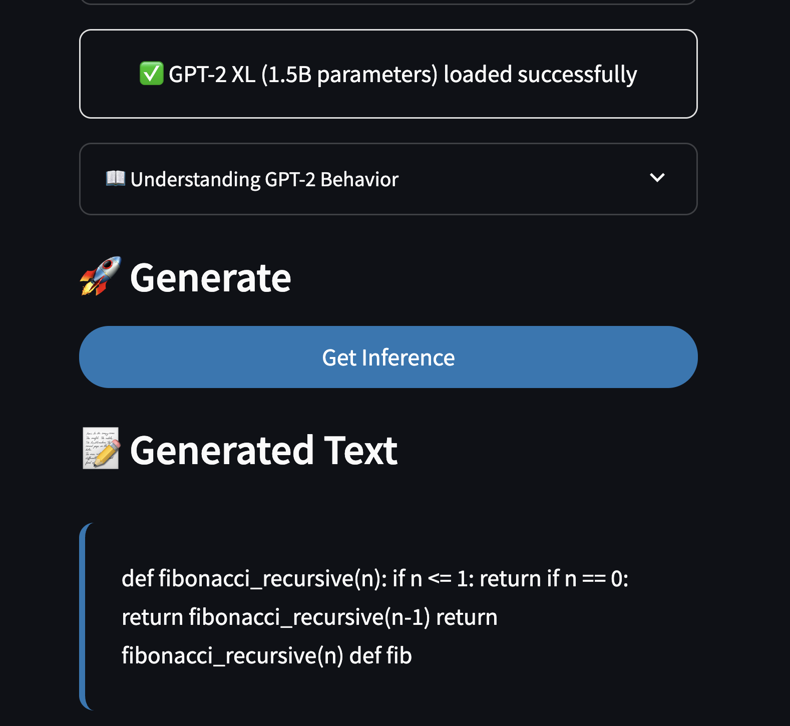

# 🤖 LLM from Scratch Project

This project is based on the "Build a Large Language Model from Scratch" book by Sebastian Raschka. The notebooks have been converted into a modular Python project that can be run with `python main.py`. 📚

## Important notes 


*Comparison of different model characteristics and quality metrics*


## 📁 Project Structure

```
├── main.py              # Main script to run demos
├── requirements.txt     # Python dependencies
├── tokenization.py      # Tokenization utilities (Chapter 2)
├── attention.py         # Attention mechanisms (Chapter 3)
├── gpt_model.py        # GPT model implementation (Chapter 4)
├── training_utils.py   # Training utilities (Chapter 5)
├── classification.py   # Classification utilities (Chapter 6)
├── README.md           # This file
└── ch*.ipynb          # Original Jupyter notebooks
```

## ⚡ Installation

1. Install dependencies:
```bash
uv pip install -r requirements.txt
```

## 🚀 Usage

### 🌐 Run Streamlit Web Interface:
```bash
streamlit run app.py
```

This launches an interactive web interface where you can:
- Generate text using pretrained GPT-2 models (Small, Medium, Large, XL)
- Adjust generation parameters (temperature, max tokens, top-k sampling)
- Try example prompts to understand GPT-2 behavior
- Switch between different model sizes



*The interactive web interface showing the prompt input and model selection options*



*Example output from GPT-2 Small model*



*Example output from GPT-2 Large model showing improved quality*


### 💻 Run Command Line Demos:

#### Run all demos:
```bash
python main.py
```

#### Run specific demos:
```bash
python main.py --demo tokenization    # Tokenization demo
python main.py --demo model          # Model creation demo
python main.py --demo generation     # Text generation demo
python main.py --demo training       # Training setup demo
python main.py --demo classification # Classification setup demo
```

## ✨ Features

## ⚙️ Model Configurations

The project includes two pre-configured models:

- **gpt2-small**: 12 layers, 768 embedding dimensions (similar to GPT-2 124M)
- **gpt2-mini**: 6 layers, 384 embedding dimensions (smaller for quick testing)


## 📖 Original Source

Based on the book "Build a Large Language Model From Scratch" by Sebastian Raschka.
- Book: http://mng.bz/orYv
- Original code: https://github.com/rasbt/LLMs-from-scratch

## 📋 Requirements

- Python 3.8+
- PyTorch 2.0+
- Other dependencies listed in requirements.txt

## 📝 Notes

- The models are simplified for educational purposes
- Training data is minimal (short story) for quick experimentation
- For production use, you would need larger datasets and more compute resources
- GPU is recommended but not required for the demos
